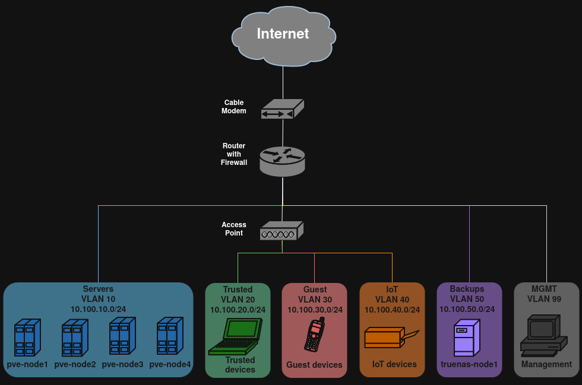

# Proxmox Network Storage Setup

**ZFS Mirror + iSCSI Target Configuration**

This guide walks through setting up a mirrored **ZFS pool** and exporting a ZVOL over **iSCSI** on Proxmox VE, including how to configure clean, enterprise-style disk names in `zpool status`.

---

## 1. List Available Disks (Using Persistent IDs)

Use the `/dev/disk/by-id/` directory to identify disks by serial number:

```bash
ls -l /dev/disk/by-id/
```

Example output:

```text
ata-Example_SSD_1_1234567890
ata-Example_SSD_1_0987654321
ata-Example_SSD_1_1122334455
```

Next, cross-reference with `lsblk` to confirm size and type:

```bash
lsblk -o NAME,SIZE,MODEL
```

Example:

```text
sda   2T  Example SSD 1
sdb   2T  Example SSD 1
sdc   1T  Example SSD 1
```

Using **persistent device IDs** from `/dev/disk/by-id/` ensures ZFS references the correct disks even if Linux device names change after reboot.

---

## 2. (Optional but Recommended) Configure Clean Disk Names

By default, `zpool status` will show long disk IDs like:

```
ata-Example_SSD_1_1234567890
```

To make the output clean and enterprise-style (e.g., `disk1`, `disk2`), configure a ZFS vdev alias file.

### 2.1 Create the VDEV Mapping File

Create the configuration file:

```bash
nano /etc/zfs/vdev_id.conf
```

Add aliases using the same disk IDs from Step 1:

```
alias disk1 /dev/disk/by-id/ata-Example_SSD_1_1234567890
alias disk2 /dev/disk/by-id/ata-Example_SSD_1_0987654321
```

Rules:

* No spaces in alias names
* Use underscores if needed
* Names are cosmetic but persistent

You may alternatively use descriptive names:

```
alias 2TB_SATA_SSD_disk1 /dev/disk/by-id/ata-Example_SSD_1_1234567890
alias 2TB_SATA_SSD_disk2 /dev/disk/by-id/ata-Example_SSD_1_0987654321
```

---

## 3. Wipe the Disks

**Warning:** This permanently erases all data.

```bash
wipefs -a /dev/sda
wipefs -a /dev/sdc
```

It is acceptable to wipe using `/dev/sdX` identifiers. The pool will be created using persistent IDs.

---

## 4. Create the ZFS Mirror Pool

Create a mirrored ZFS pool named `vmdata` using the persistent disk IDs:

```bash
zpool create -o ashift=12 \
  -O compression=lz4 \
  vmdata mirror \
  /dev/disk/by-id/ata-Example_SSD_1_1234567890 \
  /dev/disk/by-id/ata-Example_SSD_1_0987654321
```

### Explanation of Options

* `-o ashift=12` → Aligns to 4K sectors.
* `-O compression=lz4` → Enables LZ4 compression.
* `mirror` → RAID1-style redundancy with ZFS self-healing.
* Persistent IDs ensure stability across reboots.

---

## 5. Export and Re-Import to Activate Custom Names

If you configured `/etc/zfs/vdev_id.conf`, export and re-import the pool to activate aliases.

### Export:

```bash
zpool export vmdata
```

### Re-import (recommended explicit method):

```bash
zpool import -d /dev/disk/by-id -d /dev/disk/by-vdev vmdata
```

Or simply:

```bash
zpool import vmdata
```

ZFS will automatically generate:

```
/dev/disk/by-vdev/disk1
/dev/disk/by-vdev/disk2
```

---

## 6. Verify Clean Output

```bash
zpool status
```

You should now see:

```
mirror-0
  disk1
  disk2
```

Instead of long ATA identifiers.

### Important Notes

* This is cosmetic only.
* It does not change pool structure.
* It does not rewrite metadata.
* It survives reboot.
* Safe for iSCSI-backed storage.

If `vdev_id.conf` is removed, ZFS will revert to full disk IDs.

---

## 7. Configure Recommended ZFS Settings

```bash
zfs set atime=off vmdata
zfs set xattr=sa vmdata
```

* `atime=off` reduces write overhead.
* `xattr=sa` improves extended attribute handling.

---

## 8. Create a ZVOL for iSCSI

Create a 1.5 TB block device:

```bash
zfs create -V 1.5T -o volblocksize=16K vmdata/pve-iscsi
```

* `-V 1.5T` creates a ZVOL at `/dev/zvol/vmdata/pve-iscsi`
* `volblocksize=16K` optimized for VM workloads

Leave 10–25% pool capacity free for performance stability.

### Verify:

```bash
zfs list
```

---

## 9. Configure Sync Behavior

```bash
zfs set sync=standard vmdata/pve-iscsi
```

Avoid `sync=disabled` unless you fully understand the risks.

---

## 10. Install iSCSI Target Tools

```bash
apt install targetcli-fb
```

---

## 11. Load Required Kernel Modules

```bash
modprobe target_core_user
modprobe iscsi_target_mod
```

Verify:

```bash
lsmod | grep iscsi
```

---

## 12. Configure the iSCSI Target

Launch:

```bash
targetcli
```

### Create Backstore

```
/> backstores/block create pve-iscsi /dev/zvol/vmdata/pve-iscsi
```

### Create Target

```
/> iscsi/ create iqn.2026-02.com.example:pve-storage1
```

### Create LUN

```
/> iscsi/iqn.2026-02.com.example:pve-storage1/tpg1/luns create /backstores/block/pve-iscsi
```

---

### Add Portal



```
/> iscsi/iqn.2026-02.com.example:pve-storage1/tpg1/portals create 10.100.60.15
```

**Note:**
Before creating the portal, ensure that the host system is actually assigned the IP address specified in the command. The iSCSI service can only bind to an IP address that exists on one of the host’s network interfaces.

In my network design, the `10.100.60.0/24` subnet is configured as a dedicated **Storage VLAN**. The storage host (`pve-storage1`) was made VLAN-aware and assigned an IP address in this subnet by editing `/etc/network/interfaces` as shown below.

The `10.100.99.0/24` subnet is used as the **Management VLAN** and does not use DHCP.

```bash
auto lo
iface lo inet loopback

iface eth0 inet manual

auto vmbr0
iface vmbr0 inet manual
        bridge-ports eth0
        bridge-stp off
        bridge-fd 0
        bridge-vlan-aware yes
        bridge-vids 2-4094

# Storage interface (VLAN 60)
auto vmbr0.60
iface vmbr0.60 inet static
        address 10.100.60.15/24

# Management interface (VLAN 99)
auto vmbr0.99
iface vmbr0.99 inet static
        address 10.100.99.15/24
        gateway 10.100.99.1

source /etc/network/interfaces.d/*
```

With this configuration:

* `10.100.60.15` is the storage IP used by iSCSI.
* `10.100.99.15` is the management IP used for administrative access.
* Both IP addresses belong to the same host but exist on separate VLAN interfaces for network isolation.
* Both IP addresses are on different VLANs but share the same last octet, making it easier to identify the host across networks.

This separation ensures that storage traffic remains isolated from management traffic while allowing the host to service both networks simultaneously.

### Create ACL

```
/> iscsi/iqn.2026-02.com.example:pve-storage1/tpg1/acls create iqn.2026-02.com.example:pve-node1
```

### Save and Exit

```
/> saveconfig
/> exit
```

---

# Summary

You have:

* Created a mirrored ZFS pool
* Implemented clean enterprise disk naming
* Applied recommended tuning
* Created a ZVOL
* Exported storage over iSCSI
* Configured Proxmox node access

The storage can now be added in:

**Datacenter → Storage → Add → iSCSI** in Proxmox VE.
